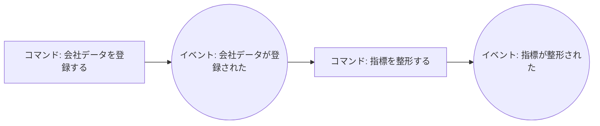

# ミニイベントストーミング

ユーザーと対話しながら以下を1ステップずつ進める。一度に全部聞かない。

## 進行手順

### Step 1: ドメインイベント収集

「この機能で起きる出来事を『〜された』の形で挙げてください」と促し、時系列に並べる。
例: 会社データが登録された / 指標が整形された / スコアが算出された / 閾値が変更された

### Step 2: コマンドとアクター

各イベントについて「誰が・何をしたら起きるか」を確認する。
例: マスターユーザーが「会社データを登録する」-> 会社データが登録された

### Step 3: 不変条件（ビジネスルール）の抽出

「このとき絶対に守られるべきルールは？」を聞く。
例: 閾値は必ず昇順9個 / スコアは1〜10 / 同一会社・同一年度の重複登録禁止

### Step 4: 集約の導出

不変条件を同時に守る単位でイベント・コマンドをグルーピング -> 集約候補とする。
判断基準: 1トランザクションで守るべきルールか？ 結果整合でよければ別集約。

### Step 5: 記録

`docs/domain-model.md` に以下の形式で追記:

