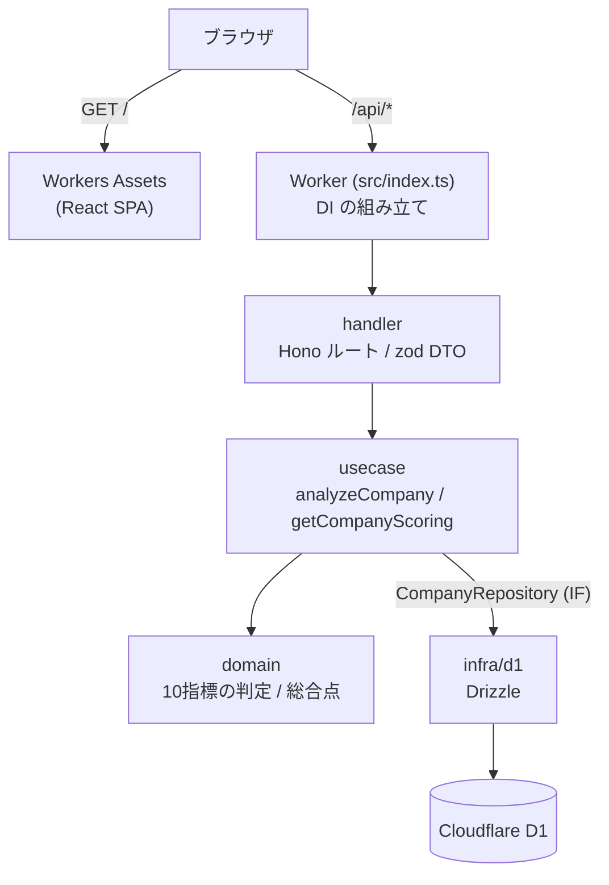

# システム全体構成

> ステータス: 🟢 確定（2026-07-28）。技術選定は
> [ADR-0001](../adr/0001-runtime-cloudflare-workers.md) で決着。
> レイヤの定義と依存ルールは `.claude/CLAUDE.md` が正。
> ドメインの構造は [domain-model.md](../domain-model.md)。

## 目的

日本株の高配当銘柄を、10指標（利回り・配当継続性・財務健全性・割安度）で
スコアリングし、レーダーチャートで比較検討できるようにする。

**やらないこと**: 投資判断の自動化、銘柄推奨、自動売買、他人への助言提供。

## 技術スタック

| 領域               | 採用                                     | 状態      | 決定理由                                    |
| ------------------ | ---------------------------------------- | --------- | ------------------------------------------- |
| ランタイム         | Cloudflare Workers（単一 Worker）        | 🟢 確定   | ADR-0001                                    |
| API                | Hono                                     | 🟢 確定   | Workers 上で軽量。DI しやすい               |
| バリデーション     | zod（**handler 境界のみ**）              | 🟢 確定   | domain の不変条件は domain 自身が守る       |
| DB                 | Cloudflare D1 + Drizzle ORM              | 🟢 確定   | SQLite。金額を整数で持つ前提と相性が良い    |
| フロント           | React + Vite + Recharts                  | 🟢 確定   | Workers Assets で配信                       |
| 言語               | TypeScript (strict)                      | 🟢 確定   |                                             |
| テスト             | Vitest + @cloudflare/vitest-pool-workers | 🟢 確定   | domain は素の Node、infra は実 workerd + D1 |
| パッケージ管理     | npm                                      | 🟢 確定   | ADR-0002（規約の pnpm からの意図的な逸脱）  |
| 株価・配当データ源 | 手動入力（貼付/CSV/株価）                | 🟢 確定   | 外部 API は使わない                         |
| 認証               | 未定                                     | 🔴 要決定 | そもそも必要か（個人利用なら不要）          |
| ホスティング       | Cloudflare（`wrangler deploy`）          | 🟡 未実施 | リモート D1 の採番がまだ                    |

## 構成図

**依存の向きは `handler -> usecase -> domain <- infra`。**
リポジトリのインターフェースは domain 側にあり、infra がそれを実装する。
`D1Database` を知るのは `src/infra/` と `src/index.ts` だけ。
この向きは `eslint.config.mjs` の `no-restricted-imports` が機械的に強制する。

## API

| メソッド | パス                   | 役割                                             |
| -------- | ---------------------- | ------------------------------------------------ |
| `GET`    | `/api/health`          | 疎通確認                                         |
| `POST`   | `/api/price/parse`     | 株価入力欄の検証（全角正規化・桁区切りの妥当性） |
| `GET`    | `/api/companies`       | 保存済み銘柄の一覧（read model）                 |
| `POST`   | `/api/companies`       | 採点して保存し、スコアカードを返す               |
| `GET`    | `/api/companies/:code` | 保存済みの生データから**採点し直して**返す       |
| `DELETE` | `/api/companies/:code` | 削除                                             |

エラー応答に内部情報（SQL・スタックトレース・パス）を含めない。

## データ源（確定）

外部 API・スクレイピングは**使わない**。ユーザーが手で持ち込む。

| 入力                 | 方式                                  | 状態                   |
| :------------------- | :------------------------------------ | :--------------------- |
| 年度別の財務データ   | 画面のフォームに直接入力              | 🟢 実装済み            |
| 配当履歴             | 画面のテキストエリアへ TSV をペースト | 🔴 未実装（F-01/F-02） |
| 業績・財務・CF・配当 | CSV をドラッグ＆ドロップ              | 🔴 未実装（F-03/F-04） |
| 現在株価             | 数値を手入力                          | 🟢 実装済み            |

**入力データの正しさをユーザーに依存する**ため、パーサー側の検証（欠損・単位・桁）が
重要になる。取り込みを実装するときは `.claude/rules/backend.md` の
「外部データは常に壊れている前提で扱う」に従うこと。

## 更新方針

- 株価・配当とも**ユーザーが入力したタイミングがすべて**。自動更新は行わない
- **入力（解析）した日時を必ず保存し、画面に表示する**（`fetched_at`）。
  古い入力値を最新として見せない

## 非機能の要点

詳細は `../01_requirements/non-functional.md`。全体に効くものだけ:

- 金額計算に浮動小数点を使わない（銭単位の整数）
- 日時は UTC 保存・JST 表示
- 外部データは検証してから永続化
- `null`（判定不能）と 0点を混同しない
