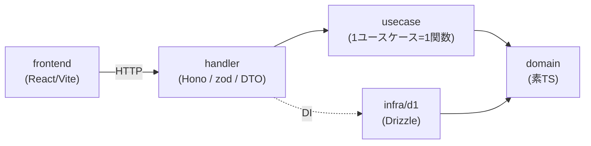
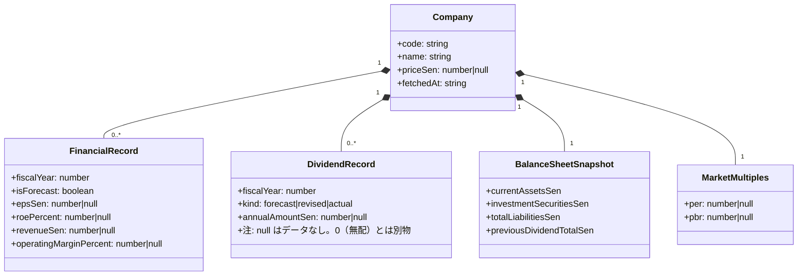
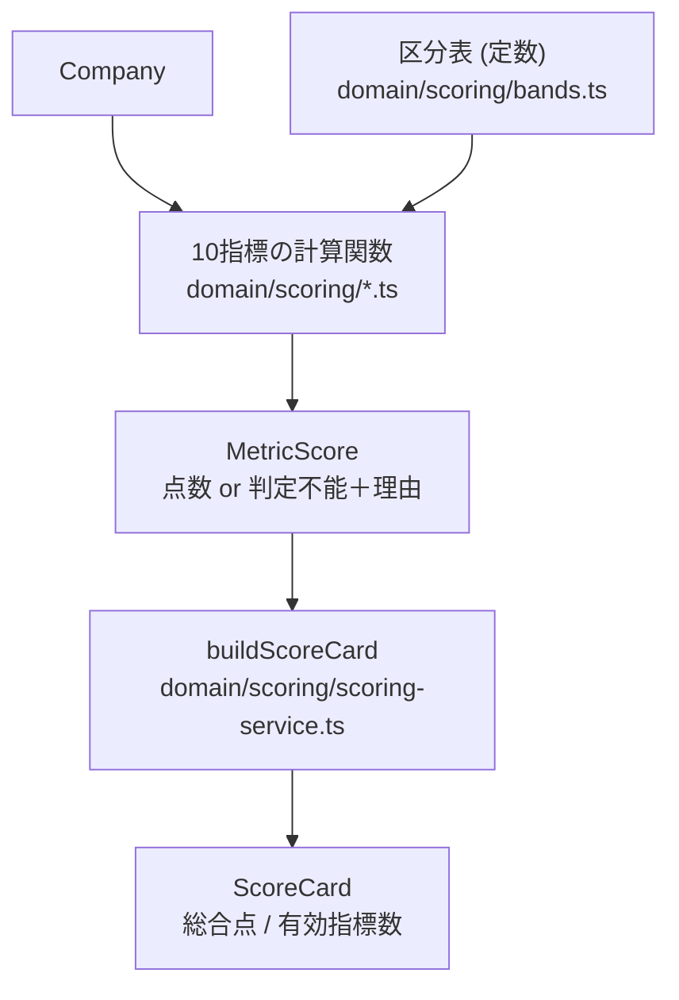

# ドメインモデル

> 2026-07-28 作成。用語の正は [glossary.md](./glossary.md)、
> スコアの数値・閾値の正は
> [scoring-requirements.md](./01_requirements/scoring-requirements.md)。
> ここには**構造と依存の向き**だけを書き、閾値を重複させない。

## 1. レイヤと依存の向き



- **`domain` は外部パッケージを import しない。** hono / drizzle / zod /
  `cloudflare:*` の import は eslint がエラーにする（`eslint.config.mjs`）
- リポジトリのインターフェースは **domain 側**（`domain/company/company-repository.ts`）。
  実装が infra にある（依存の向きが `infra -> domain` になる）
- `D1Database` を知るのは `src/infra/` と `src/index.ts` だけ

## 2. 集約



**`Company` が集約ルート。** 財務レコードと配当履歴は `Company` 経由でしか触らない。
集約をまたぐ参照は ID（`code`）で行い、オブジェクトを直接持たない。

> `records` / `dividends` は**年度降順**（先頭が直近）で持つ。並べ替えは
> handler の DTO 変換で完了させ、domain では並べ替えない。両方でやると
> どちらが正か分からなくなる。

> ✅ **2026-07-31 実装済み。** 配当は `DividendRecord` に一本化した
> （[ADR-0009](./adr/0009-dividend-single-source.md)）。上の図は現状を反映済み。

## 3. スコアリング



### 3.1 `MetricScore` — 判定不能と 0点を型で分ける

```ts
type MetricScore<R extends string = UnavailableReason> =
  | { score: Score; value: number; unavailableReason: null }
  | { score: null; value: null; unavailableReason: R };
```

`score: null && unavailableReason: null`（何も分からない）も
`score: 5 && unavailableReason: 'input-missing'`（矛盾）も**型エラー**になる。
根拠は [ADR-0003](./adr/0003-metric-score-discriminated-union.md)。

### 3.2 判定の流れ（全指標に共通）

1. **欠損の検査** — `null` があれば `input-missing`。0（無配）と混同しない
2. **数値の検査** — `NaN` / `Infinity` / 非整数を `input-invalid` で弾く。
   これを通さないと `NaN` が全ガードを素通りして**最高点**に落ちる
3. **ゼロ除算・定義不能の検査** — `division-by-zero` / `undefined-growth`。
   **0点ではない**
4. **表外の 0点ガード** — 「0%以下 → 0点」「赤字なら 0点」など、
   区分表の外で決まる規則をここで落とす
5. **区分表の参照** — `scoreByBands()`。該当なしは `value-out-of-band` で
   **判定不能**（表の穴を「低評価」として画面に出さないため）

### 3.3 区分表の解釈

**下限以上・上限未満**（§0.1）。最上位区分のみ上が開いている。
全10指標の表は `domain/scoring/bands.ts` の1ファイルに集約してある（T-014）。

⚠️ ①④⑥⑦⑧ の表に **0点の行は無い**。「0%以下 → 0点」は各設計書 §5 の例外処理であり、
表の最下段が `[0, 2) → 1点` なので、**0 ちょうどを表に渡すと 1点になってしまう**。
表を引く前のガードで落としている。

### 3.4 総合点（§0.5）

- 判定不能は **0点として合算**する。除外して分母を減らさない
- 分母は**常に 100点**
- **有効指標数を必ず併記**する（`80/100（有効 8/10）`）

旧実装はこの合算を**カード描画関数の中**でやっていた
（`reference/legacy-web/app.js:645-656`）。集計は表示層の関心事ではないので、
ドメインサービス（`buildScoreCard`）に置いた。

## 4. 永続化

| テーブル              | 役割                                                |
| --------------------- | --------------------------------------------------- |
| `companies`           | 会社の属性・株価・PER/PBR・貸借対照表・`fetched_at` |
| `financial_records`   | 年度別の生データ。PK = (会社, 年度, 予想/実績)      |
| `dividend_records`    | 年度別の配当。PK = (会社, 年度, 区分)               |
| `score_cards`         | 総合点・有効指標数・**計算バージョン**・計算日時    |
| `transformed_metrics` | 指標別の整形値。**判定不能は NULL。0 に丸めない**   |

- 生データと整形データを**両方**保存する。整形データは再計算可能だが、
  再監査（いつどのロジックでいくつだったか）のために残す
- 金額カラムは整数（銭）。`REAL` を使わない。比率・倍率は `real`
- 自然キーに PK を張り、二重取り込みを DB 層で防ぐ

> **詳細表示は保存済みの生データから採点し直す**（`getCompanyScoring`）。
> ロジックを直したあとに古い整形データを見せると、画面と実装が食い違う。

## 5. 未決・残課題

| 項目                                                                        | 状態                                                                              |
| --------------------------------------------------------------------------- | --------------------------------------------------------------------------------- |
| 認証（`UserScoringPolicy` ほか）                                            | 🔴 未決。[ADR-0005](./adr/0005-thresholds-fixed-for-now.md)                       |
| `Sen` の branding を集約まで通す                                            | 🟡 部分。[ADR-0004](./adr/0004-sen-branding-scope.md)                             |
| TSV/CSV の取り込み（F-01〜F-04）                                            | 🔴 未着手。現在はフォーム入力                                                     |
| 株式分割・決算期変更の吸収（T-035）                                         | 🔴 未決。どの層で調整するか                                                       |
| 配当の二重管理（`FinancialRecord.dividendPerShareSen` と `DividendRecord`） | ✅ 解消・実装済み（2026-07-31）。[ADR-0009](./adr/0009-dividend-single-source.md) |
| ⑧ 金融業の扱い                                                              | 🟡 保留。現状は `null` になり総合点で 10点分不利                                  |
